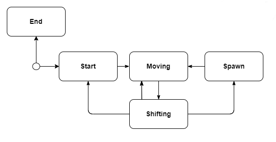
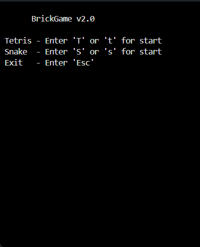
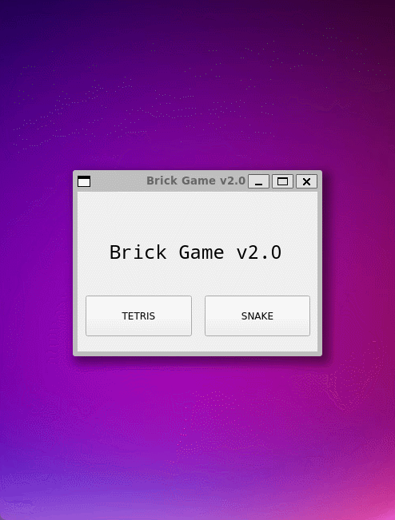

# BrickGame Змейка
Реализация игры «Змейка» на языке программирования С++ в парадигме объектно-ориентированного программирования.

## Введение

Реализация игры «Змейка» состоит из двух отдельных компонентов: библиотеки, отвечающей за реализацию логики игры, и десктопного графического интерфейса.

Разработанную библиотеку также можно подключить к консольному интерфейсу из [BrickGame v1.0](https://github.com/IgoshinSergey/BrickGame_v1.0). Консольный интерфейс полностью поддерживает новую игру.

Разработанная в [BrickGame v1.0](https://github.com/IgoshinSergey/BrickGame_v1.0) игра «Тетрис» подключена к десктопному интерфейсу, разработанному в данном проекте.

## Общая информация
### Змейка

Игрок управляет змейкой, которая непрерывно движется вперед. Игрок изменяет направление движения змейки с помощью стрелок. Цель игры заключается в сборе «яблок» появляющихся на игровом поле. При этом игрок не должен касаться стенок игрового поля. После «поедания» очередного «яблока» длина змейки увеличивается на один. Игрок побеждает, если змейка достигает максимального размера (200 «пикселей»). Если змейка сталкивается с границей игрового поля, то игрок проигрывает.

### Конечный автомат

Для формализации логики данной игры можно представить следующий вариант конечного автомата:

- Старт — состояние, в котором игра ждет, пока игрок нажмет кнопку готовности к игре.
- Спавн — состояние, в которое переходит игра при генерировании яблочка.
- Перемещение — основное игровое состояние с обработкой ввода от пользователя — смена направления змейки.
- Сдвиг — состояние, в которое переходит игра после истечения таймера. В нем змейка делает движение.
- Игра окончена — игра окончена.

## Описание

BrickGame v2.0:

- Программа разработана на языке C++ стандарта C++17.
- Программа состоит из двух частей: библиотеки, реализующей логику игры змейка, и десктопного интерфейса.
- Для формализации логики игры был использован конечный автомат.
- Код библиотеки программы находиться в папке src/brick_game/snake.
- Код с интерфейсом программы находиться в папке src/gui/desktop.
- Классы реализованы внутри пространства имен `s21`.
- Библиотека, реализующая логику игры, покрыта unit-тестам. Особое внимание уделено проверке состояний и переходами КА. Для тестов использовалась библиотека GTest.
- Сборка программы настроена с помощью Makefile со стандартным набором целей для GNU-программ: all, install, uninstall, clean, dvi, dist, tests. 
- Реализация графического пользовательского интерфейса на базе GUI-библиотеки Qt.
- Программа реализована с использованием паттерна MVC.

### Управление и игровое поле

- В игре змейка должны присутствуют следующие механики:
  - Змейка передвигается по полю самостоятельно, на один блок вперед по истечении игрового таймера.
  - Когда змейка сталкивается с «яблоком», ее длина увеличивается на один.
  - Когда длина змейки достигает 200 единиц, игра заканчивается победой игрока.
  - Когда змейка сталкивается с границей поля или сама с собой, игра заканчивается поражением игрока.
  - Пользователь может менять направление движение змейки с помощью стрелок, при этом змейка может поворачивать только налево и направо относительно текущего направления движения.
  - Пользователь может ускорять движение змейки зажатием клавиши действие.
- Для управления имеется поддержка всех кнопок, предусмотренных на физической консоли:
  - Начало игры - 'ENTER',
  - Пауза - 'P',
  - Завершение игры - 'ESC',
  - Стрелка влево — сменить направление змейки,
  - Стрелка вправо — сменить направление змейки,
  - Стрелка вниз — сменить направление змейки,
  - Стрелка вверх — сменить направление змейки,
  - Действие (ускорение змейки) - 'Z'.
- Начальная длина змейки равна четырем «пикселям».
- Игровое поле имеет размер 10 «пикселей» в ширину и 20 «пикселей» в высоту.
- подсчет очков;
- хранение максимального количества очков.

### Уровни

В игре реализованы следующие механики:

- подсчет очков;
- хранение максимального количества очков.

Данная информация передается и выводится пользовательским интерфейсом в боковой панели. Максимальное количество очков хранится в файле и сохраняется между запусками программы.

Максимальное количество очков изменяется во время игры, если пользователь во время игры превышает текущий показатель максимального количества набранных очков.

Как только змейка кушает яблочко, счет увеличивается на 1.

Каждый раз, когда игрок набирает 5 очков, уровень увеличивается на 1. Повышение уровня увеличивает скорость движения змейки. Максимальное количество уровней — 10.

### Build

Сборка программы настроена с помощью Makefile

* `make install` - Компиляция консольной и десктопной версии игры BrickGame_v2.0
* `make unistall` - Удаление программы
* `make dvi` - Компиляция LaTex файла с описанием проекта
* `make dist` - Архивирование проекта
* `make test` - Покрытие unit-тестами c помощью библиотеки GTest
* `make gcov_report` - Формирование отчёта gcov в виде html страницы
* `make leaks` - Проверка тестов на утечки памяти
* `make clang` - Проверка кода на Google style
* `make clean` - Удаление ненужных файлов

## Запуск игры BrickGame v2.0

### Command-line Interface

### Desktop Snake

### Desktop Tetris

